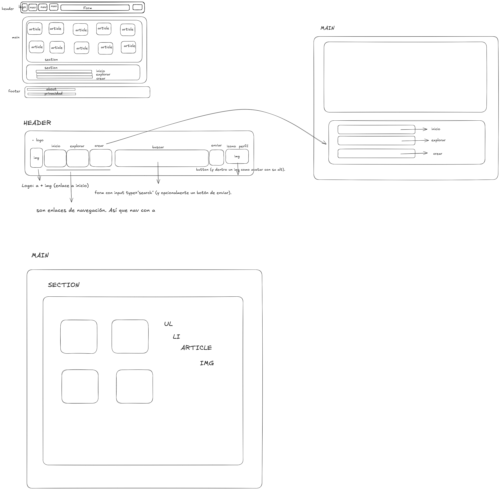

En el Head, he incluido el - Canonical URL: La etiqueta link rel="canonical" para evitar contenido duplicado. 
y marcar cual es la página original

Dentro del Body tengo: 
    header: 
        El logo: sera una imagen + un enlace a la home de la pagina
        Tres enlaces de navegacion:
            inicio con nav a pagina de inicio
            explorar con un nav a pagina de explorar
            crear con un nav a pagina de crear

        Un buscador, para ello voy a usar un form con metodo GET + un boton type submit, para enviar la información, ya que el usuario al introducir
        su busqueda, el formulario va a enviar una informacion y recuperar el resultado. Uso label para mejorar la accesibilidad

        Icono de perfil: tambien una imagen + menu desplegable.
            Tu cuenta
            Edita el perfil
            Cierra sesion
        Para esto uso la etiqueta interactiva Details + summary que hemos visto en este modulo.
        Dentro de summary, va la foto de perfil
        Dentro de details una ul con li a los diferentes enlaces ficticios.

    Main:
        Una section principal, inicio/feed con los pines. 
            Creo una sectio con id= inicio, para que el nav de inicio apunte a esa seccion.
            Dentro de la seccion, ordeno los pines en una lista con ul + li. 
            En cada li, va un artículo con un titulo descriptivo + la img que apuntan a una pagina separada.
        Las secciones a las que apuntan los nav del header:
            Explorar:
                Hago una sección id: explorar y dentro hago tres categorias, con urls amigables
                Uso un H3 dentro de un a, para obtener un titulo clicable que apunta a la url.
            Crear:
                En esta seccion el usuario puede subir una un archivo, para crear su pin, con un
                titulo, una descripcion.
                Para esto uso: 
                    Un Form con metodo POST y enctype="multipart/form-data" como metodo estandar para enviar archivos en un form 
                        Un campo para el titulo con texto, sera campo requerido con required
                        Un campo para la descripcion con un area de texto
                        Un campo para subir archivo, se puede subir cualquier tipo de archivo con accept=imagen/*
                        Uso 
                        Un boton para enviar con input type = submit, value=Enviar 
        
        Icono de ayuda: 
            Justo antes del footer meto el icono de ayuda lo hago con la etiqueta aside para que pueda estar dentro del main
            pero como si fuera en un menu al lado del contenido principal
            Le añado un title para que al pasar el raton tenga el titulo de ayuda.  
            Tambien uso el atributo aria-label por accesibilidad, ya que es solo un icono de ?, y comunmente se 
            identifique como ayuda, le digo al navegador lo que es exacatemente
        
        Footer:
            Uso una UL con varios li para apuntar a tres enlaces 
            un Parrafo para introcudir el siguenos en redes sociales, con ul +li
            Uso la etiqueta small para hacer el texto del copyright más pequeño

## ARQUITECTURA

DOCUMENTACION: 
    https://keepcoding.io/blog/como-hacer-un-buscador-en-html/
    https://stackoverflow.com/questions/4526273/what-does-enctype-multipart-form-data-mean#:~:text=enctype%3D%22multipart%2Fform%2Ddata%22%20is%20an%20encoding,you%20must%20use%20this%20enctype.
    https://www.w3schools.com/tags/att_form_enctype.asp
    https://www.w3schools.com/tags/tag_small.asp
    IA: 
        GPT
        NotebookLM con los apuntes del modulo.